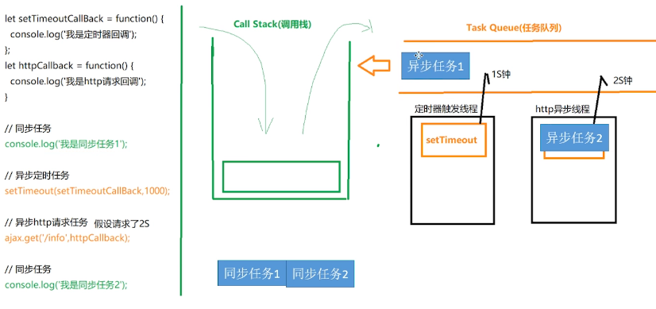

# 类型
## null 是对象嘛？
不是对象，属于7种类型（number, string, boolean, array, function, obejct, symbol）里的原始类型。有个bug：typeof null 输出 object
## 对象类型和原始类型的不同之处？函数参数是对象会发生什么问题？
原始类型里存放的是原始值，对象类型里存放的是地址。对象类型被当做参数传递的时候，因为是引用的地址，内部改变这个变量，外部的变量也会改变。
## typeof 是否能正确判断类型？instanceof 能正确判断对象的原理是什么？
- 不能。
- instanceof原理：
    fish instanceof Animal ==> Animal.prototype.isPrototypeOf(fish)
    - 会检查整个原型链
    - 除了null和undefine,其他`对象`instanceof object 都是True
    - 对原始类型不成立
    ```js
    123 instanceof Object
    //false 对原始类型不成立
    [123,456] instanceof Object
    //true
    undefined instanceof Object
    //false
    ```
- typeOf用来检查原始类型，instan检查对象类型。
- 更准确的检查方法：`Object.prototype.toString().call(fish)`
## 加法的计算规则
    除了加法，剩下的都是
# why'[] == []' return false? why'[] == ![]' return true? 
# 什么是闭包？
闭包由一个函数和它的周围变量组成。闭包函数是一个函数中的函数，用来获取父级函数的内部变量，通常会被父级函数返回，即便是父级函数寿命终结了，这个闭包函数仍然可以访问他周围环境的变量，使得这些局部变 量可以常驻内存中。
## 闭包的使用场景有哪些？
1. 防抖与节流
    解决的问题：短时间内频繁触发某个操作（比如Ajax通信）<br>
    都是让某个时间期限内，事件处理函数只执行一次。
    - 防抖：n秒后再执行该事件，如果等待时间内被再次触发，则重新计时。
        [为什么要用？](https://blog.csdn.net/weixin_44986776/article/details/123377618)
        ```js
            function debounce(fn, delay){
                let timer = null;
                return function(){
                    if(timer){
                        clearTimeout(timer)
                        timer = setTimeOut(fn, delay)
                    }else{
                        timer = setTimeOut(fn, delay)
                    }
                }
            }
        ```
    - 节流：技能冷却，触发后，在一段时间内方法失效。
        ```js
            function throttle(fn, delay){
                let valid = true
                return function(){
                    if(!valid){return}
                    valid = false
                    setTimeOut(()=>{
                        fn()
                        valid = true
                    }, delay)
                }
            }
        ```
    - vue中使用lodash库来节流
        ```js
            import {throttle} from 'lodash';
            throttle(function(){},100)
        ```
2. 封装私有属性和私有方法
    ```js
    function Person(name) {
    var _age; //注意私有变量的写法
    function setAge(n) {
        _age = n;
    }
    function getAge() {
        return _age;
    }

    return {
        name: name,
        getAge: getAge,
        setAge: setAge
    };
    }

    var p1 = Person('张三');
    p1.setAge(25);
    p1.getAge() // 25
    ```

## 执行环境（执行上下文）
```js
function nihao(){ var say = "fuckyou" }
console.log(say) //会报错
```
是因为没有进入到nihao内部的执行环境，而是直接在全局环境中打印say
## 什么是作用域链？
当函数嵌套的时候，内层函数只能在外层函数的作用域中执行，如果需要使用到某个变量，首先会在当前作用域中查找，若没有找到，就继续往上一层作用域中找，直到找到全局作用域。我们称这种链式的查询关系为作用域链。
## for-var和for-let
```js
for(var i =0;i<5;i++){
    setTimeout(function(){
        console.log(i++)
    },4000)
}
console.log(i)
``` 
输出结果是： 5 四秒后 5 6 7 8 9
如果for中的var改为let，输出就是：报错 四秒后 0 1 2 3 4
如果想继续用var的话可以这样改：
```js
for(var i=0;i<5;i++){
    (function(x){
        setTimeout(function(){
            console.log(x++)
        },4000)
    })(i);//立即执行函数，趁着i还没变立即传给函数
}
console.log(i)
```
输出：5 四秒后 5 6 7 8 9
# 什么是浅/深拷贝？如何实现？
    1. 对象类型在赋值的时候其实是复制了地址，这样就会导致改变一个地方，其他引用的地方也被变动。解决这个问题只有拷贝一个全新的对象，拷贝一个对象意味着拷贝他的属性方法，浅拷贝就是拷贝对象的第一层属性值，如果第一层属性值里还有对象的话，浅拷贝复制的仍然是地址。深拷贝就完完全全地创造了一个全新的和原来的一模一样的对象。
    2. 浅拷贝的实现[assign doc](https://developer.mozilla.org/zh-CN/docs/Web/JavaScript/Reference/Global_Objects/Object/assign)
        ```js
        let b = Object.assign({},a)
        ```
    3. 深拷贝的实现
        ```js
        ```

# 讲一下原型链？//需要补充
# 什么是暂时性死区？
    js中存在变量提升和函数提升，只提升声明不提升赋值，对于var声明的变量在赋值前使用的话会返回undefined，但是对于let和const声明的变量来说会直接报错。在变量声明到赋值的这一段空间称为暂时性死区。
# 面向对象
## 什么是原型链？
1. 对于实例来说，构造函数称为原型，每一个构造函数都有一个属性叫prototype指向一个对象，这个原型对象上的属性和方法，将会被所有实例所继承。另一方面，这个原型对象也有他自己的原型，同样会继承原型对象上的方法。当一个实习需要用到某个属性的时候，它会首先在自己身上找，没找到后去原型上找，找不到的话，就去原型的原型上找，直到最顶层的Object.prototype，还是找不到的话就返回undefined，这个实例到原型，再到原型的原型这个查找路径就称为原型链。

2.`constructor`属性在构造函数的prototype属性对象上，指向构造函数本身
实例将会继承`constructor`<br>
`实例.constructor===构造函数.prototype.constructor`
## 继承
1. es6的新做法 
    ```js
    class fish extends Animal{
        constructor(food,color){
            super(food); //在子类中使用this之前必须先使用父类的构造函数
            this.color = color
        }
    }
    ```
2. es5的做法
    ```js
    // 第一步，子类继承父类的实例
    function shark(){
        Animal.call(this)
    }
    // 第二步，子类继承父类的原型
    //Object.create利用已有对象的原型创建一个新的对象
    shark.prototype = Object.create(shape.prototype)
    shark.prototype.constructor = shark;
    ```

# 为什么要使用模块化？
解决命名冲突
提供复用性
提高代码可维护性
# Proxy 太复杂了没有看，等看完再补充
# 异步操作
## 事件循环
浏览器是多线程，js是单线程<br>
有些线程是常驻线程<br>
如：GUI渲染、js引擎、浏览器事件线程(onclick)
<br>
有些线程当他被用到的时候才会调用<br>
如：定时器、http异步、事件循环处理线程<br>
遵循先同步后异步的原则，下图的同步任务会先跑，异步任务放在各自的线程中，等同步任务全都跑完，异步任务在指定的时间时就会被加载到任务队列，然后进入栈中。


## 定时器
1. 定时器中的回调函数如果是对象的方法，则指向全局环境而不是该对象<br>
解决办法：使用bind
    ```js
    var x = 1;

    var obj = {
    x: 2,
    y: function () {
        console.log(this.x);
    }
    };

    setTimeout(obj.y, 1000)
    //1

    setTimeout(obj.y.bind(obj), 1000)
    // 2
    ```

2. setTimeout执行1次，setInterval,无限次每隔ms执行<br>
都会返回定时器编号，clearTimeout(id1);clearInterval(id2);可以取消定时器
3. 原理
    <br>是将指定的代码移出本轮`事件循环`，等到下一轮事件循环，再检查是否到了指定时间。如果到了，就执行对应的代码；如果不到，就继续等待。
    <br>必须等到本轮事件循环的所有同步任务都执行完，才会开始执行。
4. setTimeout(f,0)
    执行完当前的事件循环后，尽早地执行f


### 引申：重排重绘

重绘(repaint)，改变样式而不影响布局。损耗少。<br>
重排（layout），又叫回流需要重新计算和布局。开销大。

重排一定会引起重绘，反之不一定。
为了限制对他们的大量使用，就需要防抖和节流。

# 什么是内存泄漏？JS内存泄露如何检测？场景有哪些？
- 不再用到的内存，没有及时释放，就叫做内存泄漏（memory leak）。
- 大多数语言有自动内存管理，减轻程序员的负担，这被称为"垃圾回收机制"（garbage collector）。（闭包中的数据不属于垃圾回收）
- 垃圾回收的算法：
    1. 引用计数，有循环引用的问题
        - 语言有一张引用表，保存了内存中资源的引用次数。当次数等于0时，就回收这个资源。

